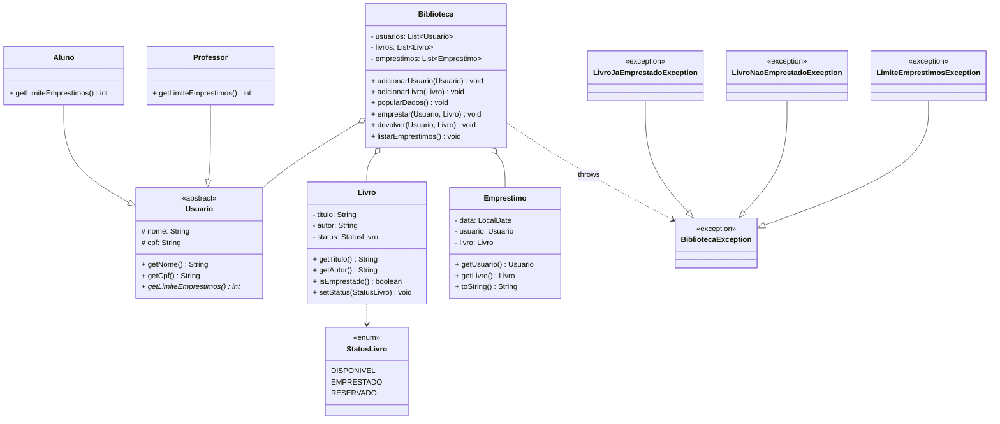

```mermaid
classDiagram
    direction TB

    class StatusLivro {
        <<enum>>
        DISPONIVEL
        EMPRESTADO
        RESERVADO
    }

    class Usuario {
        <<abstract>>
        # nome: String
        # cpf: String
        + getNome() String
        + getCpf() String
        + getLimiteEmprestimos() int*
    }

    class Aluno {
        + getLimiteEmprestimos() int
    }

    class Professor {
        + getLimiteEmprestimos() int
    }

    class Livro {
        - titulo: String
        - autor: String
        - status: StatusLivro
        + getTitulo() String
        + getAutor() String
        + isEmprestado() boolean
        + setStatus(StatusLivro) void
    }

    class Emprestimo {
        - data: LocalDate
        - usuario: Usuario
        - livro: Livro
        + getUsuario() Usuario
        + getLivro() Livro
        + toString() String
    }

    class Biblioteca {
        - usuarios: List~Usuario~
        - livros: List~Livro~
        - emprestimos: List~Emprestimo~
        + adicionarUsuario(Usuario) void
        + adicionarLivro(Livro) void
        + popularDados() void
        + emprestar(Usuario, Livro) void
        + devolver(Usuario, Livro) void
        + listarEmprestimos() void
    }

    class BibliotecaException {
        <<exception>>
    }

    class LivroJaEmprestadoException {
        <<exception>>
    }

    class LivroNaoEmprestadoException {
        <<exception>>
    }

    class LimiteEmprestimosException {
        <<exception>>
    }

    Aluno --|> Usuario
    Professor --|> Usuario

    LivroJaEmprestadoException --|> BibliotecaException
    LivroNaoEmprestadoException --|> BibliotecaException
    LimiteEmprestimosException --|> BibliotecaException

    Biblioteca o-- Usuario
    Biblioteca o-- Livro
    Biblioteca o-- Emprestimo

    Livro ..> StatusLivro
    Biblioteca ..> BibliotecaException : throws
```