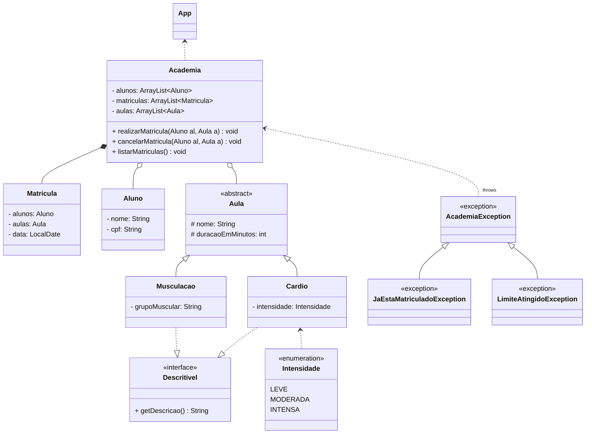

[//]: # (🏋️ Sistema de Academia)

[//]: # (Enunciado:)

[//]: # (Uma academia oferece diferentes tipos de aulas para seus alunos. Cada aula tem um nome e uma duração em minutos. Aulas de musculação têm um grupo muscular alvo &#40;ex: "peito", "costas"&#41;. Aulas de cardio têm uma intensidade, representada por um nível que pode ser leve, moderada ou intensa.)

[//]: # (A academia mantém uma lista de alunos, aulas e matrículas. Uma matrícula registra qual aluno está inscrito em qual aula e em que data.)

[//]: # (O sistema deve permitir que um aluno se matricule em uma aula, listar todas as matrículas e cancelar uma matrícula. O sistema deve lançar exceções quando um aluno tentar se matricular duas vezes na mesma aula, ou quando uma aula já tiver atingido o limite de 10 alunos matriculados.)

[//]: # (Todo tipo de aula deve ser capaz de fornecer uma descrição textual de seus detalhes.)

