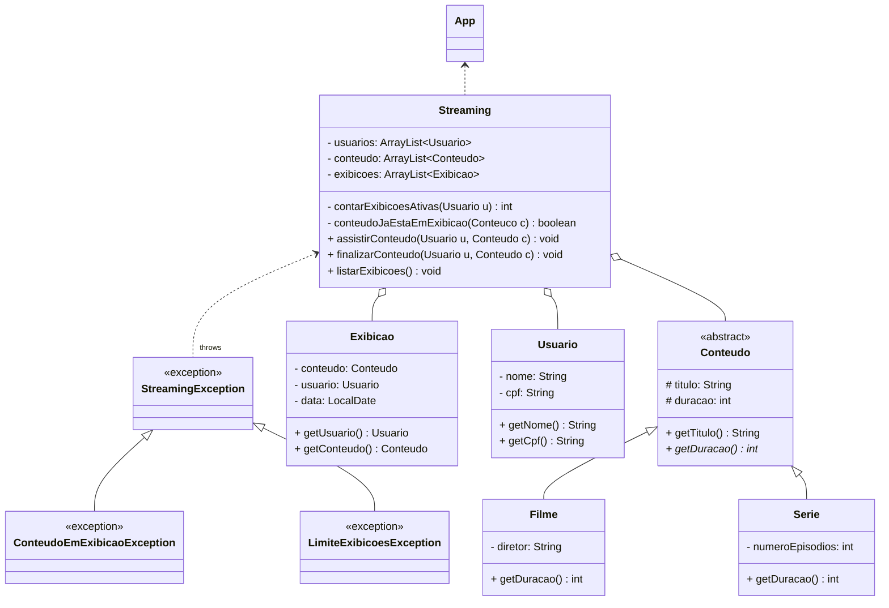

```mermaid
classDiagram
    direction TB

%%    Enunciado: Sistema de Streaming
%%    Uma plataforma de streaming permite que usuários assistam filmes e séries. 
%%    Cada conteúdo tem título e duração. Um filme tem diretor, uma série tem número de episódios. 
%%    A plataforma mantém um histórico de reproduções, registrando qual usuário assistiu qual conteúdo e em que data. 
%%    O sistema deve lançar exceções quando um usuário tentar assistir um conteúdo já em reprodução, ou quando atingir o limite de 2 reproduções simultâneas.
%%    

    class App {
        
    }
    
    class Streaming {
        - usuarios: ArrayList~Usuario~
        - conteudo: ArrayList~Conteudo~
        - exibicoes: ArrayList~Exibicao~
        - contarExibicoesAtivas(Usuario u) int
        - conteudoJaEstaEmExibicao(Conteuco c) boolean
        + assistirConteudo(Usuario u, Conteudo c) void
        + finalizarConteudo(Usuario u, Conteudo c) void
        + listarExibicoes() void
    }
    
    class Conteudo {
        <<abstract>>
        # titulo: String
        # duracao: int
        + getTitulo() String
        + getDuracao() int*
    }
    
    class Filme {
        - diretor: String
        + getDuracao() int
    }
    
    class Serie {
        - numeroEpisodios: int
        + getDuracao() int
    }
    
    class Exibicao {
        - conteudo: Conteudo
        - usuario: Usuario
        - data: LocalDate
        + getUsuario() Usuario
        + getConteudo() Conteudo
    }
    
    class Usuario {
        - nome: String
        - cpf: String
        + getNome() String
        + getCpf() String
    }
    
    class StreamingException {
        <<exception>>
    }
    
    class ConteudoEmExibicaoException {
        <<exception>>
    }
    
    class LimiteExibicoesException {
        <<exception>>
    }
    
    App <.. Streaming
    Streaming <.. "throws" StreamingException
    Streaming o-- Conteudo
    Streaming o-- Exibicao
    Streaming o-- Usuario
    Conteudo <|-- Filme
    Conteudo <|-- Serie
    StreamingException <|-- ConteudoEmExibicaoException
    StreamingException <|-- LimiteExibicoesException

```